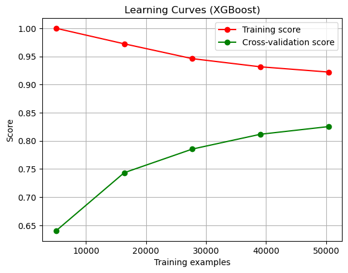
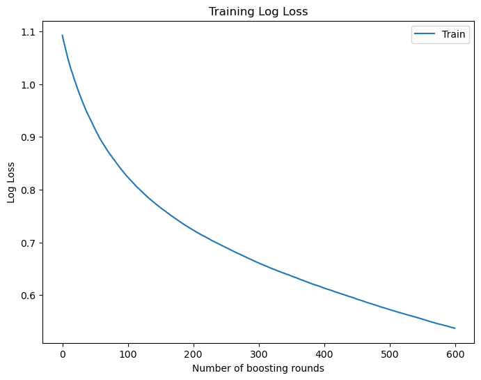
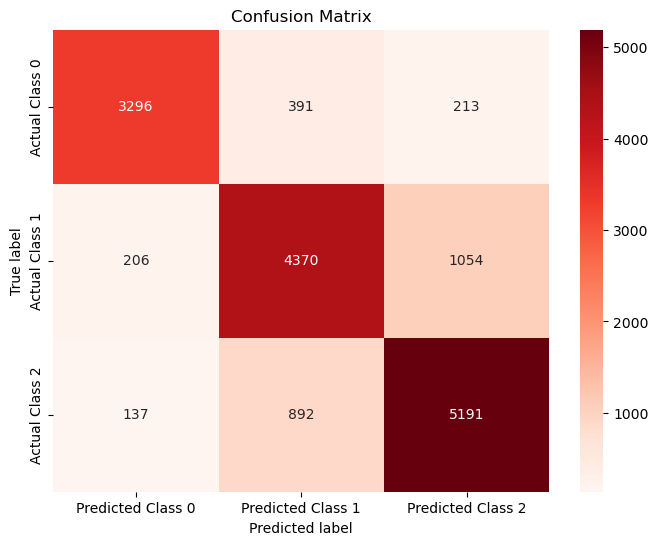

# Sentiment Analysis of IMDB Movie Reviews

## Introduction
For this project, I aimed to perform sentiment analysis on IMDB movie reviews. My dataset consisted of over 36,000 reviews, each accompanied by movie ratings ranging from 0 to 10. The primary objective was to construct a machine learning model capable of categorizing reviews into three sentiment classes: negative, neutral, and positive.

## Data Collection
I collected the dataset using my web scraping code, extracting movie reviews and their corresponding ratings from IMDB.

## Exploratory Data Analysis and Preprocessing
- **Data Cleaning:** After removing null values and eliminating irrelevant characters, punctuation, and stop words, my dataset was reduced to 32,505 rows and 2 columns.
- **Labeling:** I categorized reviews into sentiment classes based on their ratings (1-3 as negative, 4-6 as neutral, 7-10 as positive).
- **Class Imbalance Check:** I observed an imbalance among sentiment classes, particularly with the negative class having the lowest representation. To address this, I could gather more data, synthesize additional data, perform oversampling, or employ an algorithm designed to handle data imbalances, like XGBoost.
- **Tokenization:** Following data cleaning, I tokenized and structured the cleaned data into a formatted DataFrame for further analysis.
- The plot below displays the representation of each class within the dataset.

## Model Building
### 1. Blazing Text
- I initially employed BlazingText using AWS for classification but encountered accuracy issues (~47%) due to class imbalance.

### 2. Word2Vec Embedding & XGBoost
Implementing Word2Vec for embedding, I trained an XGBoost model achieving around 63% accuracy for test data and 77% for training data.

**However, high dimensionality and slower processing speed were challenges faced.**

- Evaluation metrics for XGBoost model
  
| Accuracy on the training dataset | Accuracy on the test dataset | Precision | Recall |
| -------- | -------- | -------- | -------- |
| 0.77   | 0.63   | 0.62   | 0.63   |

### 3. PCA for Dimensionality Reduction
- To reduce dimensions while maintaining accuracy, I implemented Principal Component Analysis (PCA).
- This significantly improved code efficiency and model building speed without compromising accuracy.
 
- Learning curve for XGBoost model combined with PCA

   
- Cost function for XGBoost model combined with PCA

  
- Confusion matrix for XGBoost model combined with PCA

- Evaluation metrics for XGBoost-PCA model
  
| Accuracy on the training dataset | Accuracy on the test dataset | Precision | Recall |
| -------- | -------- | -------- | -------- |
| 0.88   | 0.62   | 0.61   | 0.62   |

### 4. Addressing Class Imbalance
Based on these results, synthesizing reviews using RandomOverSampler method from the imblearn library was done. The plot of data count after synthesizing is showing below:

The XGBoost model was rebuilt, and the output of the final model is displayed below:

- Learning rate for XGBoost model trained with oversampled data with PCA

- Cost funstion for XGBoost model trained with oversampled data with PCA

- Confusion matrix for XGBoost model trained with oversampled data with PCA

- Evaluation metrics for XGBoost-PCA oversampled model
  
| Accuracy on the training dataset | Accuracy on the test dataset | Precision | Recall | F1|
| -------- | -------- | -------- | -------- | -------- |
| 0.91  | 0.81 | 0.81  | 0.81   |0.81|

The result showed significant improvement in the model
