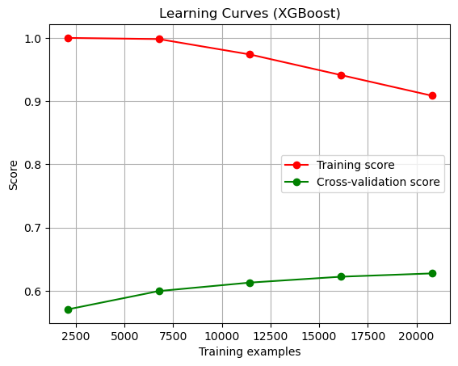

# Sentiment Analysis of IMDB Movie Reviews

## Introduction
This project aimed to perform sentiment analysis on IMDB movie reviews, using a dataset comprising over 36,000 reviews, each with movie ratings ranging from 0 to 10. The primary goal was to build a machine learning model capable of categorizing reviews into three sentiment classes: negative, neutral, and positive.

## Data Collection
I collected the dataset by employing a custom web scraping code, extracting movie reviews alongside their respective ratings from IMDB.

## Exploratory Data Analysis and Preprocessing
- **Data Cleaning:** After removing null values and irrelevant characters, as well as handling punctuation and eliminating stop words, the dataset was trimmed to 32,505 rows and 2 columns.
- **Labeling:** Reviews were categorized into sentiment classes based on their ratings (1-3 as negative, 4-6 as neutral, 7-10 as positive).
- **Class Imbalance Check:** There was an observed imbalance among sentiment classes, with the negative class having the least representation.
- 
- **Tokenization:** Processed the cleaned data and organized it into a structured DataFrame for further analysis.

## Model Building
### 1. Blazing Text
- Utilized Blazing Text for initial classification.
- Encountered challenges due to class imbalance, resulting in an accuracy of approximately 47%.

### 2. Word2Vec Embedding & XGBoost
- Employed Word2Vec for embedding and trained an XGBoost model for classification.
- Experienced a notable increase in accuracy compared to Blazing Text, achieving around 63% accuracy for test data and 77% for training data.
- 
- 
- However, faced challenges related to high dimensionality and slower processing speed.

### 3. PCA for Dimensionality Reduction
- Implemented Principal Component Analysis (PCA) to reduce dimensions while maintaining accuracy.
- Significantly improved code efficiency and model building speed without compromising accuracy.
- 
- 
- 

### 4. Addressing Class Imbalance
- Attempted to enhance accuracy by oversampling the minority class (negative sentiment).
- Despite efforts, the maximum accuracy plateaued around 61%.

### 5. SVM with RBF Kernel
- Explored Support Vector Machines (SVM) using an RBF kernel as an alternative model.
- Achieved similar accuracy results (~62%) to XGBoost, reaffirming the consistency of accuracy across models.
- 
- 
- Used a vector of random numbers from 0 to 100 to find the best value for the C parameter in SVM, determining 10 as optimal.
- 

## Conclusion and Insights
This project revealed several significant findings:
- The maximum accuracy plateaued at around 63% due to inherent challenges like class imbalance.
- Consistent accuracy levels were observed across different models (XGBoost, SVM), suggesting limitations in surpassing the 63% mark.
- Insights gained in handling class imbalances and managing high dimensions using PCA for more efficient modeling.
